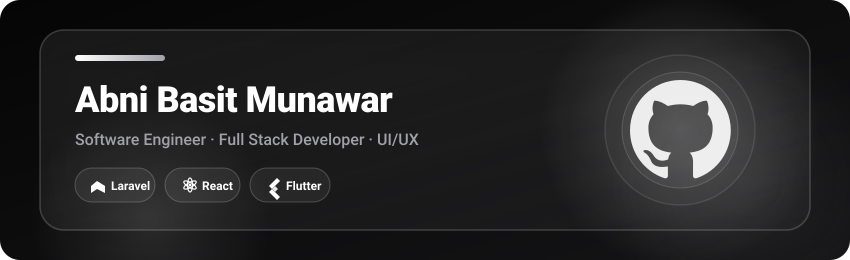

<div align="center">

<!-- Header Banner -->


<br/>
<br/>

<!-- Subtitle Role Pills -->
☕ **Full Stack Developer** &nbsp;|&nbsp; 🎨 **UI/UX** &nbsp;|&nbsp; 🚀 **SaaS Builder** &nbsp;|&nbsp; 📱 **Mobile Dev (Flutter)**

<br/>

<!-- Connect Badges -->
<a href="https://www.linkedin.com/in/abni-basit-munawar-47210a286/"></a>
<a href="https://instagram.com/abnibsth"></a>
<a href="mailto:abni4250@gmail.com"></a>
<a href="https://discord.com/users/abnibsth"></a>

<br/>

[](https://github.com/abnibsth)
[](https://github.com/abnibsth)

</div>

---

### About

Saya Abni, developer dari Indonesia yang fokus membangun web app & mobile app yang **rapi, cepat, dan enak dipakai**.  
Sehari-hari main di **Laravel** (backend), **React** (frontend), dan **Flutter** (mobile) — sambil terus belajar biar makin solid di full stack.

```text
📍 Indonesia      💼 Full Stack Web Dev       🎮 Gaming · Anime · Exploring Tech
```

---

### 👾 Contribution Game Animation

<div align="center">

<picture>
  <source media="(prefers-color-scheme: dark)" srcset="https://raw.githubusercontent.com/abnibsth/abnibsth/output/github-contribution-grid-snake-dark.svg">
  <source media="(prefers-color-scheme: light)" srcset="https://raw.githubusercontent.com/abnibsth/abnibsth/output/github-contribution-grid-snake.svg">
  
</picture>

</div>

---

### Tech Stack

<div align="center">


</div>

---

### What I Build

| Area | Detail |
|:---|:---|
| **Backend** | API, auth, routing, logika bisnis — **Laravel / PHP** |
| **Frontend** | UI interaktif & komponen reusable — **React**, HTML, CSS |
| **Database** | Desain query & relasi data — **MySQL / PostgreSQL** |
| **Workflow** | Git, GitHub, Postman, tooling modern |

---

### GitHub Stats

<div align="center">


<br/>
<br/>


</div>

---

### Currently Learning

<div align="center">


</div>

---

### Connect

<div align="center">

<a href="https://www.linkedin.com/in/abni-basit-munawar-47210a286/"></a>
<a href="https://instagram.com/abnibsth"></a>
<a href="mailto:abni4250@gmail.com"></a>
<a href="https://discord.com/users/abnibsth"></a>
<a href="https://twitter.com/abnibsth"></a>

</div>

---

<div align="center">

<sub>"Code is like humor. When you have to explain it, it's bad." — Cory House</sub>

<br/>

<sub>© Abni Basit Munawar · <a href="https://github.com/abnibsth">github.com/abnibsth</a></sub>

</div>